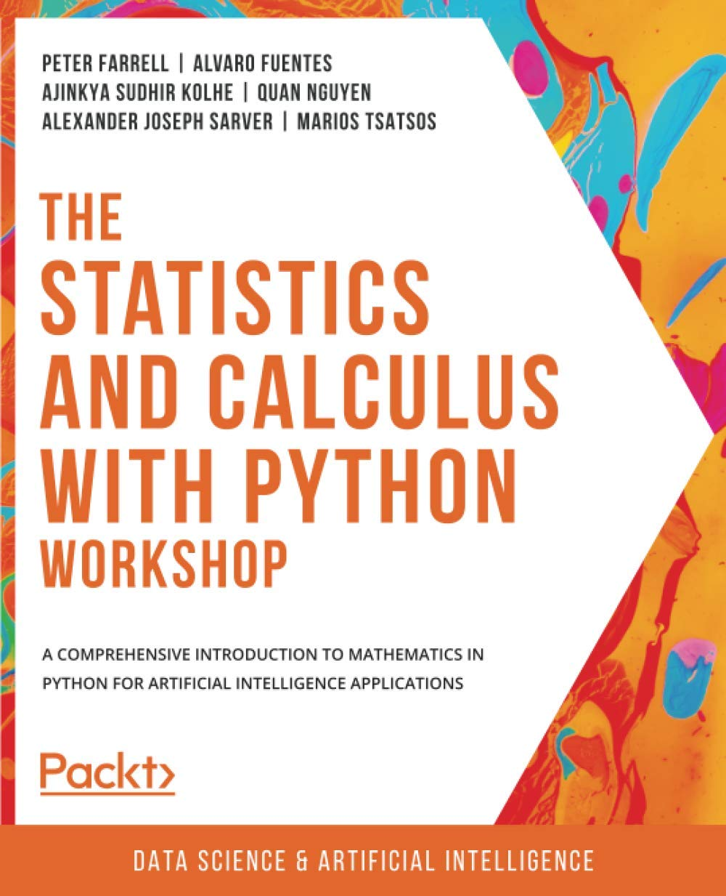
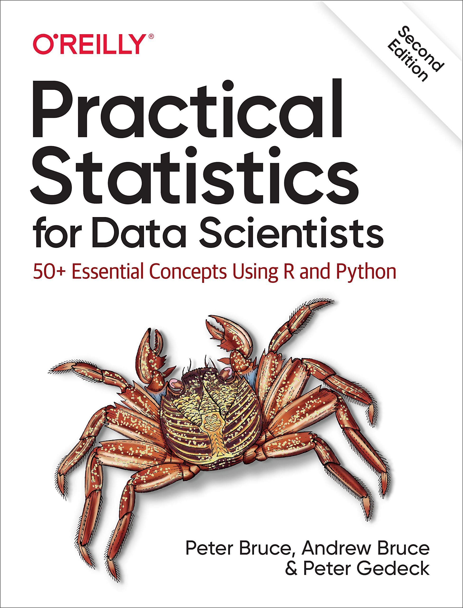
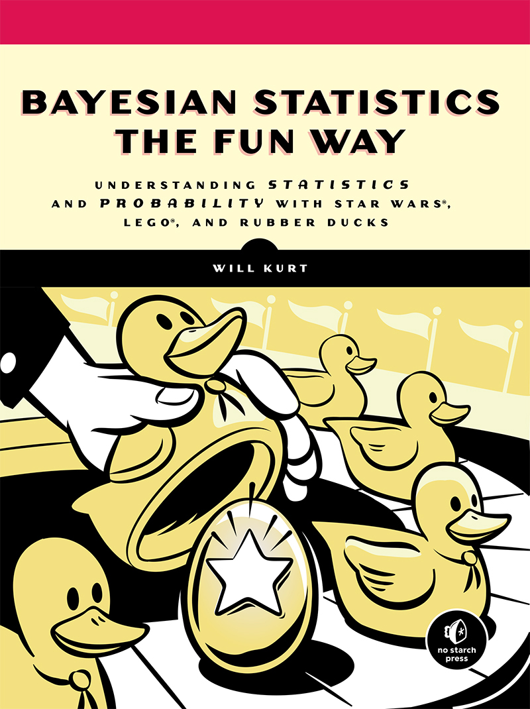
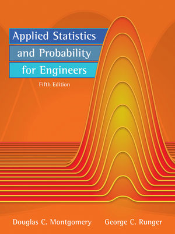

# Statistika Terapan Berbasis OpenSource

Statistika Terapan Berbasis OpenSource ini dibuat untuk merekam catatan pembelajaran Statistika. Opensource yang dimaksud adalah menggunakan bahasa pemrograman Python.

Dikarenakan background pemrakarsa adalah bidang engineering, maka contoh-contoh akan lebih dekat dengan penerapan pada bidang engineering.

## 1. Sumber-sumber pembelajaran

Diantara sumber-sumber belajar yang dapat digunakan adalah:

1. Website
2. Buku
3. Notebook (`fileName.ipynb`)

### 1.1 Website

Website yang menarik untuk digunakan sebagai sumber belajar adalah:

### 1.2 Buku
----------------------
> ___Disclaimer___:
> _Saya tidak merekomendasikan menggunakan buku-buku  secara ilegal baik bajakan ataupun unduh tanpa hak.Buku yang saya cantumkan disini, saya memiliki akses baik membeli cetak atau akses melalui akun resmi universitas tempat saya menimba ilmu._
----------------------
Buku yang dapat digunakan untuk sumber belajar saya urutkan berdasarkan tingkat kesulitan (mudah -> sulit), ialah sebagai berikut:

1. [The Statistics and Calculus with Python Workshop, Farrel et al., 2020](https://learning.oreilly.com/library/view/the-statistics-and/9781800209763/)

2. [Practical Statistics for Data Scientists, 2nd Edition](https://learning.oreilly.com/library/view/practical-statistics-for/9781492072935/)

3. [Bayesian Statistics the Fun Way](https://learning.oreilly.com/library/view/bayesian-statistics-the/9781098122492/#toc)

4. [Applied Statistics and Probability for Engineers, 5e, Montgomery, Runger](https://learning.oreilly.com/library/view/applied-statistics-and/9780470053041/)
[>Datasets](https://bcs.wiley.com/he-bcs/Books?action=resource&bcsId=5849&itemId=0470053046&resourceId=21602)

### 1.3 Notebook (`fileName.ipynb`)

Notebook yang digunakan baik yang mendampingi buku yang tertera di atas ataupun tersedia secara mandiri. diantaranya:

1. [The Statistics and Calculus with Python Workshop, Farrel et al., 2020](https://github.com/PacktWorkshops/The-Statistics-and-Calculus-with-Python-Workshop)
2. [Practical Statistics for Data Scientists, 2e, 2020](https://github.com/gedeck/practical-statistics-for-data-scientists)
3. [Bayesian Statistics the Fun Way](https://github.com/willkurt?tab=repositories) Notebook untuk buku ini masih belum tersedia, bisa jadi dalam waktu dekat mendatang
4. [Applied Statistics and Probability for Engineers, 5e, Montgomery, Runger]() Notebook untuk buku ini masih belum tersedia, bisa jadi dalam waktu dekat mendatang. Adapun dataset dapat di unduh di: [>Datasets](https://bcs.wiley.com/he-bcs/Books?action=resource&bcsId=5849&itemId=0470053046&resourceId=21602)

